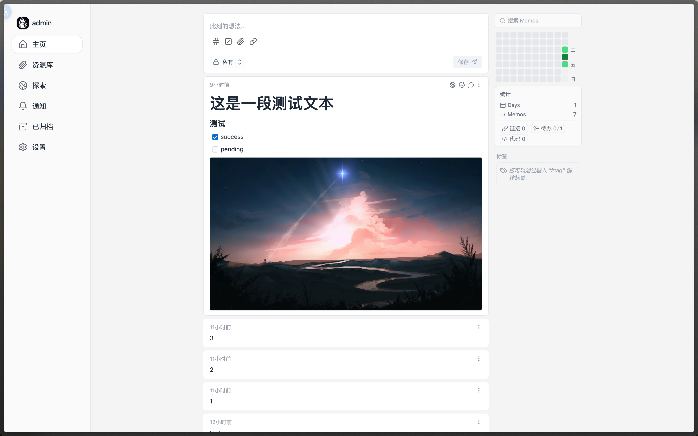
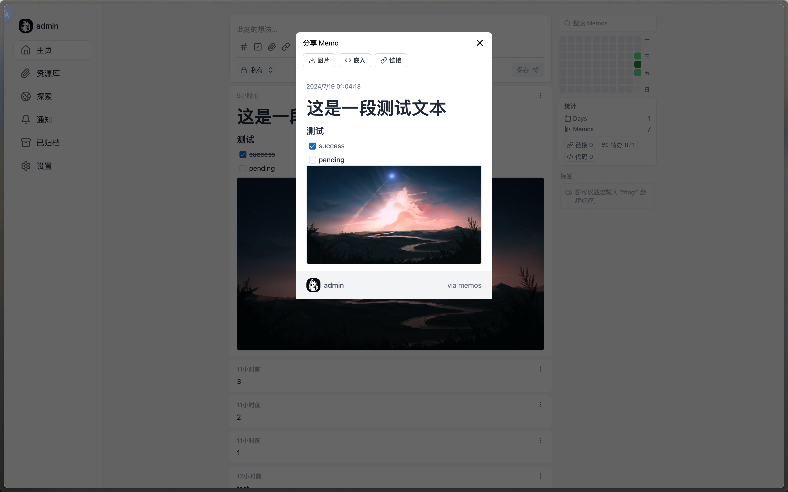

A privacy-first, lightweight note-taking service. Easily capture and share your great thoughts.

<a href="https://www.usememos.com">Home Page</a> •
<a href="https://www.usememos.com/blog">Blogs</a> •
<a href="https://www.usememos.com/docs">Docs</a> •
<a href="https://demo.usememos.com/">Live Demo</a>

<p>
  <a href="https://hub.docker.com/r/kuusei/memos"></a>
</p>



## fork 信息
本 fork 主要用于补充和微调一些页面样式, 基本不修改后端代码
因此任何修改都没有配置项, 均为直接修改前端功能

- 目前调整的功能
  - 调整首页热力图显示为类0.18.0版本, 改进热力图组件功能[支持filter传递和搜索, 重载ui/切换页面都不丢失筛选信息]
  - 关闭 Profile 入口[未关闭实际功能, 但可能有不兼容]
  - 恢复旧版本分享功能, 可以生成图片/embed/url
    - 分享时右下角改为显示当前访问域名
  - archived 页面显示图片
  - 支持 s3 存储 prefixURL 功能
  - memo action 样式
  - 新增 memo embed 支持
- 目前修复的问题
  - 时间筛选时, 由于字符串问题导致本地时间错误
  - 点击弹窗需要加载多个接口问题
  - 旧版本分享功能生成图片时出现被下载图片在页面闪烁
  - 统计 Memos 数量闪烁
  - 图片显示过高

注意: 如果有需要, 建议自行fork后使用, 短期内会有比较多的更新, stable 分支也不会很稳定

## 变更预览

- 恢复首页热力图显示 & 关闭 Timeline/Profile 入口

- 分享功能


## Key points

- **Open source and free to use**. Embrace a future where creativity knows no boundaries with our open-source solution. All features are free to use and will never be charged in any form or content.
- **Self-hosting with Docker in just seconds**. Enjoy the flexibility, scalability, and ease of setup that Docker provides, allowing you to have full control over your data and privacy.
- **Pure text with added Markdown support.** Say goodbye to the overwhelming mental burden of rich formatting and embrace a minimalist approach.
- **Customize and share your notes effortlessly**. With our intuitive sharing features, you can easily collaborate and distribute your notes with others.
- **RESTful API for third-party services.** Embrace the power of integration and unleash new possibilities with our RESTful API support.

## Deploy with Docker in seconds

```bash
docker run -d --name memos -p 5230:5230 -v ~/.memos/:/var/opt/memos neosmemo/memos:stable
```

> [!NOTE]
> This command is only applicable for Unix/Linux systems. For Windows, please refer to the detailed [documentation](https://www.usememos.com/docs/install/self-hosting).
>
> The `~/.memos/` directory will be used as the data directory on your local machine, while `/var/opt/memos` is the directory of the volume in Docker and should not be modified.

Learn more about [other installation methods](https://www.usememos.com/docs/install).

## Contribution

Contributions are what make the open-source community such an amazing place to learn, inspire, and create. We greatly appreciate any contributions you make. Thank you for being a part of our community! 🥰

## Internationalization

Memos supports multiple languages. You can help us translate Memos into your language. We use Weblate to manage translations.

<a href="https://hosted.weblate.org/engage/memos-i18n/">

</a>

## Star history

[](https://star-history.com/#usememos/memos&Date)

## Other projects

- [**Slash**](https://github.com/yourselfhosted/slash): An open source, self-hosted bookmarks and link sharing platform. Save and share your links very easily.
- [**Gomark**](https://github.com/usememos/gomark): A markdown parser written in Go for Memos. And its [WebAssembly version](https://github.com/usememos/gomark-wasm) is also available.
